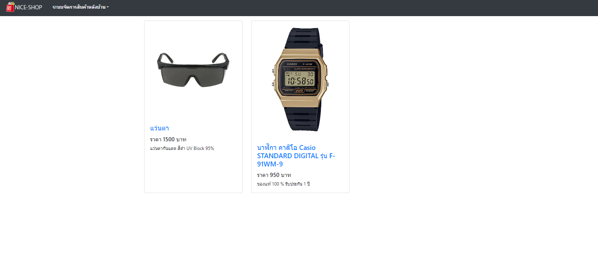

# Store-Management-By-Nodejs

An application for training in using nodejs to manage products within the store. By adding, deleting, or editing products within the store, this is done in the part of the administrator only.

Links Solution URL: [https://github.com/hedisnice/Store-Management-By-Nodejs]
